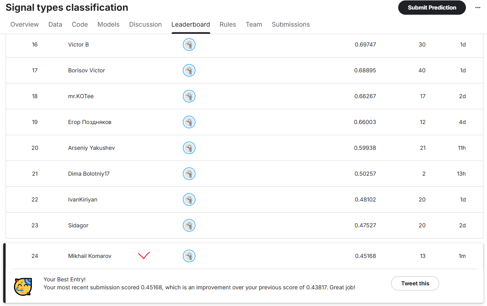

# Кластеризация сцинтилляционных сигналов с использованием GPU

Проект посвящён кластеризации импульсных сигналов сцинтилляционного детектора без разметки.
Основная цель — разделить два типа сигналов (например, нейтроны и гамма-кванты) на основе их формы.

Ключевые особенности:
- Использование **физически осмысленных признаков** (амплитуда, площадь, PSD, время высвечивания).
- Понижение размерности с помощью **PCA**.
- Кластеризация с помощью **k-means на GPU (PyTorch)**.
- Автоматическая подготовка среды и воспроизводимый запуск.

## Структура репозитория

- `src/load_data.py` — загрузка и предобработка сигналов (baseline, выделение сигнала).
- `src/extract_physical_features.py` — извлечение физических признаков (A, S, PSD, tau).
- `src/gpu_pca_clustering.py` — нормировка признаков, PCA и k-means на GPU.
- `notebooks/EDA.ipynb` — исследовательский анализ данных (EDA).
- `data/` — входной файл с сигналами (формат 23000 x 504).
- `submission/` — пример файла `submission.csv`, отправленного на Kaggle.

## Подготовка среды

Рекомендуется использовать conda:

```bash
conda env create -f environment.yml
conda activate scinti-clustering
```

Либо через `setup_env.sh`:

```bash
bash setup_env.sh
conda activate scinti-clustering
```

В проекте используется GPU через PyTorch (`torch.cuda.is_available()` должен возвращать `True`).
На CPU код также работает, но медленнее.

## Запуск пайплайна

1. Поместить файл с сигналами (например, `Run200_Wave_0_1.txt`) в директорию `data/`.
2. Извлечь признаки:

```bash
python -m src.extract_physical_features
```

Будет сохранён файл `physical_features.csv`.

3. Выполнить кластеризацию (PCA + k-means на GPU):

```bash
python -m src.gpu_pca_clustering
```

Результат сохранится в `submission/submission.csv`.

Этот файл можно отправить на Kaggle. В текущей конфигурации лучший достигнутый результат — **0.45168**.

## Краткое описание метода

1. **Выделение сигнала**
   Для каждого измерения из 500 отсчётов выделяется сигнал, начиная с максимума и до области, где данные возвращаются к базовой линии шума.

2. **Физические признаки**
   - `A` — максимальная амплитуда сигнала.
   - `S` — площадь под сигналом (интеграл по времени).
   - `PSD` — нормированное соотношение площади хвоста к общей площади, аналог pulse shape discrimination.
   - `tau` — эффективное время высвечивания из экспоненциальной аппроксимации хвостовой части.

3. **Нормировка и PCA**
   Признаки стандартизируются (вычитание среднего и деление на стандартное отклонение) и понижаются до 2 главных компонент с помощью PCA.

4. **Кластеризация на GPU**
   В пространстве двух главных компонент выполняется k-means, реализованный на PyTorch.
   Использование GPU значительно ускоряет итерации и позволяет легко запускать несколько случайных инициализаций для выбора лучшего разбиения.

## EDA и сравнение моделей

В ноутбуке `notebooks/EDA.ipynb` проведён:
- анализ распределений A, S, PSD, tau;
- визуализация сигналов и шумового фона;
- сравнение различных вариантов признакового пространства:
  - сырые сигналы (500 точек),
  - FFT-признаки,
  - вейвлет-признаки,
  - автоэнкодер,
  - простые временные признаки,
  - физические признаки (текущий лучший вариант).

Для качественной оценки кластеризации дополнительно использовались:
- индекс Calinski–Harabasz,
- коэффициент силуэта.
## Сравнение моделей и представлений данных

В ходе работы были протестированы различные способы представления сигналов и алгоритмы кластеризации.
В качестве внешнего критерия качества использовалась метрика соревнования на Kaggle (score по загруженному `submission.csv`).

| № | Представление данных                  | Алгоритм кластеризации          | Использование GPU | Пример признаков                              | Результат Kaggle |
|---|---------------------------------------|----------------------------------|-------------------|-----------------------------------------------|------------------|
| 1 | Сырые сигналы (500 отсчётов)         | k-means                          | Да (PyTorch)      | 500 значений амплитуды по времени             | ≈ 0.36           |
| 2 | Частотное представление (FFT)        | k-means                          | Да (PyTorch)      | Модуль спектра (сжатые FFT-признаки)          | ≈ 0.36           |
| 3 | Вейвлет-признаки (DWT)               | k-means                          | Да (PyTorch)      | Энергии уровней разложения, доли энергии      | ≈ 0.36           |
| 4 | Автоэнкодер по сигналу               | k-means в латентном пространстве | Да (PyTorch)      | Вектор скрытого слоя автоэнкодера             | ≈ 0.39           |
| 5 | Простые временные признаки           | k-means                          | Да (PyTorch)      | Амплитуда, время нарастания, интеграл и др.   | ≈ 0.41–0.43      |
| 6 | **Физические признаки + PCA (основной)** | **k-means на PCA-компонентах**   | **Да (PyTorch)**  | **A, S, PSD, tau → 2 главные компоненты**     | **0.45168**      |

Основные выводы:

- Использование «сырых» сигналов и их простых преобразований (FFT, DWT) даёт сопоставимое качество и значительно уступает подходу с физическими признаками.
- Автоэнкодер даёт небольшой прирост, но остаётся хуже, чем набор осмысленных временных признаков.
- Лучший результат достигнут на компактном признаковом описании, основанном на физике сцинтиллятора (амплитуда, площадь, PSD, время высвечивания) и последующем понижении размерности с помощью PCA.
- Во всех вариантах вычислительно тяжёлые операции (k-means, вычисление расстояний, автоэнкодер) выполнялись на GPU средствами PyTorch, что позволило перебрать несколько конфигураций моделей и признаков в разумное время.
## Подходы, которые были протестированы

Помимо финального решения на физических признаках, в работе были опробованы несколько других идей.
Они важны для понимания, почему выбран именно текущий подход.

### 1. k-means по сырым сигналам

**Идея.**
Использовать сами временные ряды длины 500 как признаковое пространство, без дополнительной параметризации.
Предполагалось, что различия формы импульса (быстрая/медленная компоненты) отразятся напрямую в 500-мерном пространстве.

**Реализация.**
- Считывание матрицы \(N \times 500\) после вырезания метаданных.
- Масштабирование (при необходимости) и запуск k-means на GPU через PyTorch.

**Наблюдения.**
- Алгоритм сходится, но кластеры сильно «расплывчаты», границы размыты.
- В таком высокоразмерном пространстве много шума, и эвклидово расстояние плохо отражает именно различия форм, а не индивидуальные флуктуации.
- Метрика Kaggle ≈ 0.36 — заметно хуже, чем при последующей параметризации сигналов.

---

### 2. Частотное представление (FFT)

**Идея.**
Перейти от временного описания к частотному: если типы сигналов различаются по длительности и форме, это должно проявляться в спектре амплитуд.
Ожидалось, что спектральные коэффициенты лучше отделят «быстрые» и «медленные» импульсы.

**Реализация.**
- Для каждого сигнала вычислялось дискретное преобразование Фурье (FFT).
- Из спектра выбирались либо все частоты, либо сжатый набор (первые K коэффициентов, модули).
- Далее эти векторы подавались в k-means на GPU.

**Наблюдения.**
- Спектральные признаки оказались сильно коррелированными и чувствительными к шуму.
- Разделение в пространстве FFT не стало чище, чем во временном.
- Результат на Kaggle остался на уровне ≈ 0.36.

---

### 3. Вейвлет-признаки (DWT)

**Идея.**
Вейвлет-преобразование одновременно учитывает и время, и частоту, что логично для кратковременных импульсов.
Ожидалось, что энергия по уровням разложения (приближения и детали) сможет отделить разные типы сигналов лучше, чем голый FFT.

**Реализация.**
- Для каждого сигнала выполнялось дискретное вейвлет-преобразование (например, db4, 3 уровня).
- В качестве признаков брались энергии коэффициентов: \(E_{A3}, E_{D3}, E_{D2}, E_{D1}\) и их доли в общей энергии.
- На полученных векторах запускался k-means (GPU).

**Наблюдения.**
- Несмотря на красивую теорию, в наших данных полученные вейвлет-фичи вели себя очень похоже на FFT.
- Внутренние индексы качества кластеров не показывали явного улучшения структуры.
- Kaggle-результат снова ≈ 0.36.

---

### 4. Автоэнкодер по сигналу

**Идея.**
Построить компактное представление сигнала через нейросетевой автоэнкодер: сеть сама «решит», какие скрытые признаки важны для реконструкции формы.
Предполагалось, что латентный вектор (бутылочное горлышко) будет хорошим признаковым описанием для кластеризации.

**Реализация.**
- Одномерный автоэнкодер на PyTorch с несколькими полносвязными слоями.
- Обучение на реконструкцию сигналов (MSE между входом и выходом).
- Извлечение латентного вектора для каждого сигнала.
- k-means по латентным представлениям (на GPU).

**Наблюдения.**
- Автоэнкодер действительно учится восстанавливать сигналы, но его цель — реконструкция, а не разделение типов.
- Латентное пространство оказалось более компактным, чем 500-мерный input, но структурно не давало чётких, разделимых кластеров.
- Итоговый скор немного вырос (≈ 0.39), но всё ещё уступал более простым физическим признакам.

---

### 5. Простые временные признаки

**Идея.**
Перейти от «сырых» рядов к набору простых статистик по времени: максимум, время достижения максимума, различные интегралы и усреднения.
Это первый шаг к физически осмысленной параметризации.

**Реализация.**
- Для каждого сигнала считались: амплитуда, разные варианты площади под сигналом, время до пика, длительность хвоста и т.п.
- Эти признаки нормировались и подавались в k-means (GPU).

**Наблюдения.**
- Уже такой простой набор признаков заметно улучшил качество кластеризации.
- Внутренние метрики (силуэт, Calinski–Harabasz) показывали более компактные кластеры.
- Kaggle-результат поднялся до ≈ 0.41–0.43.

Однако этот подход всё ещё был скорее «эмпирическим» и не полностью опирался на физику процесса.

---

### 6. Физические признаки + PCA (финальный подход)

**Идея.**
Использовать признаки, напрямую связанных с физикой сцинтилляционного детектора:
- амплитуда пропорциональна поглощённой энергии,
- площадь под сигналом связана с полным световыходом,
- PSD описывает форму импульса (отношение хвоста к началу),
- время высвечивания характеризует скорость затухания.
После этого сжать пространство признаков до 2 главных компонент, где различия между типами сигналов выражены наиболее сильно.

**Реализация.**
- `A` — максимум сигнала.
- `S` — интеграл по времени по всем 500 отсчётам.
- `PSD` — \((\text{long} - \text{short}) / \text{long}\), где `short` — окно после максимума, `long` — весь сигнал.
- `tau` — параметр экспоненциального затухания, полученный из fit хвостовой части сигнала; аномальные значения заменяются медианой по выборке.
- Нормировка признаков и PCA до 2 компонент.
- k-means на полученных 2D-точках, реализованный на GPU с несколькими инициализациями.

**Наблюдения.**
- Кластеры в пространстве первых двух PCA-компонент визуально разделяются значительно лучше, чем во всех предыдущих подходах.
- Физические признаки оказываются устойчивыми к шуму и хорошо отражают различия в природе сигналов.
- Достигнут лучший на текущий момент результат на Kaggle: **0.45168**.


## GPU

Код автоматически определяет наличие GPU:

```python
DEVICE = "cuda" if torch.cuda.is_available() else "cpu"
```

Если доступен CUDA-совместимый GPU, все тензорные вычисления (PCA-признаки, k-means, расстояния до центроидов) выполняются на видеокарте.
Это позволяет быстро перебрать несколько инициализаций k-means и разных наборов признаков.

## Результат на Kaggle

Ниже приведён скриншот с результатом соревнования на Kaggle для финальной конфигурации (физические признаки + PCA + k-means на GPU):



Достигнутый скор на паблик-лидерборде: **0.45168**.
